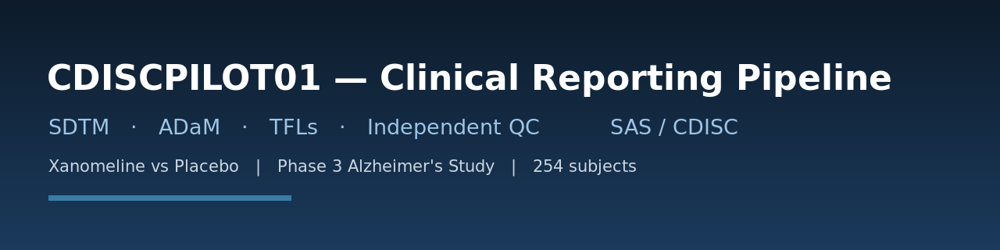
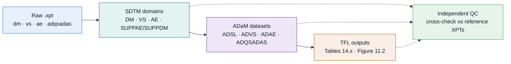
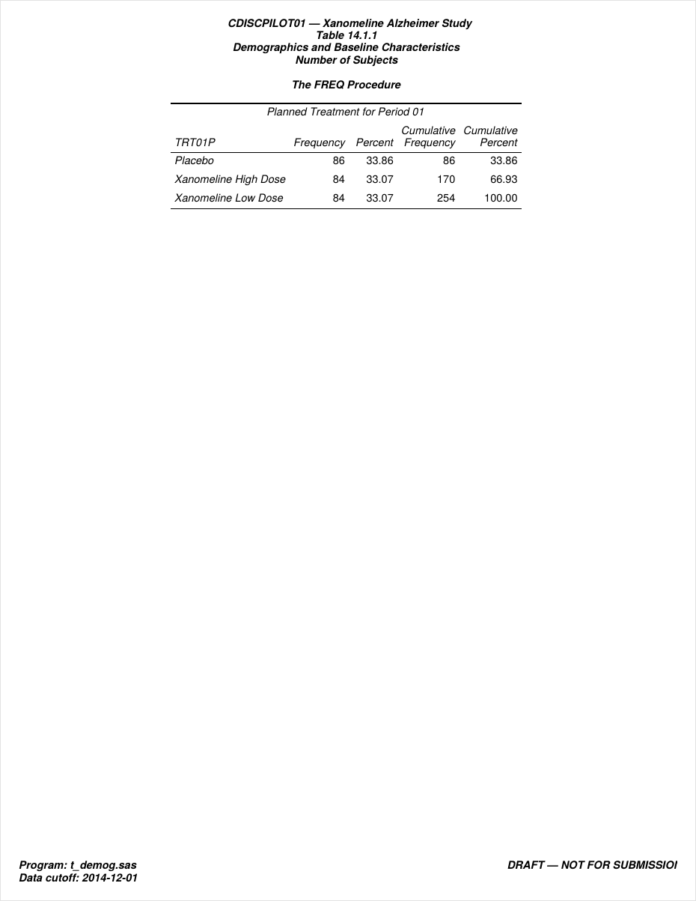
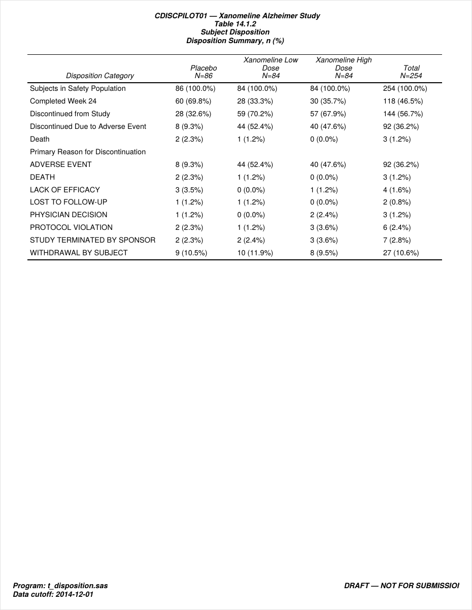
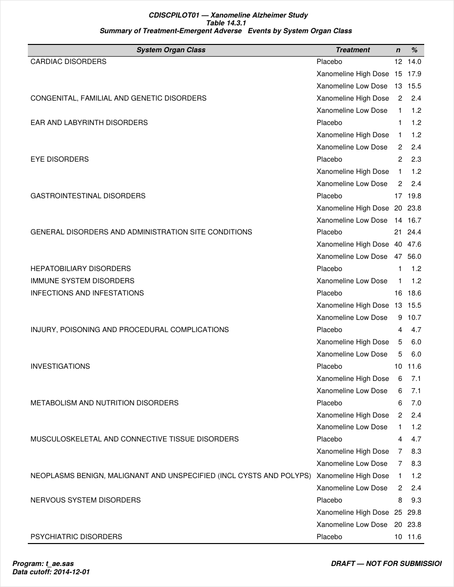
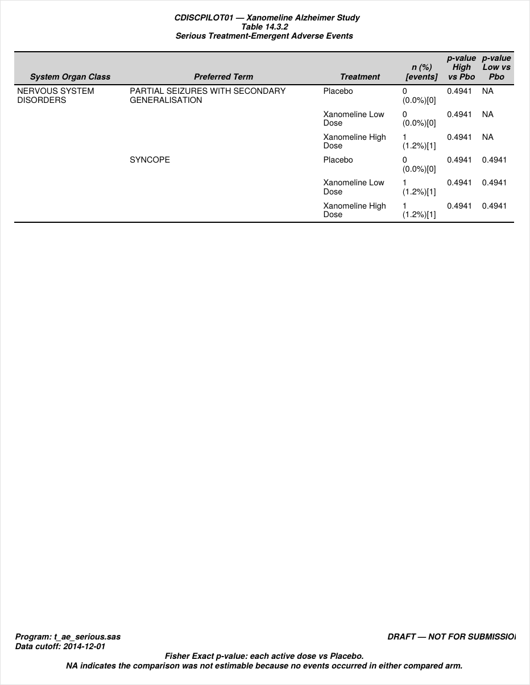
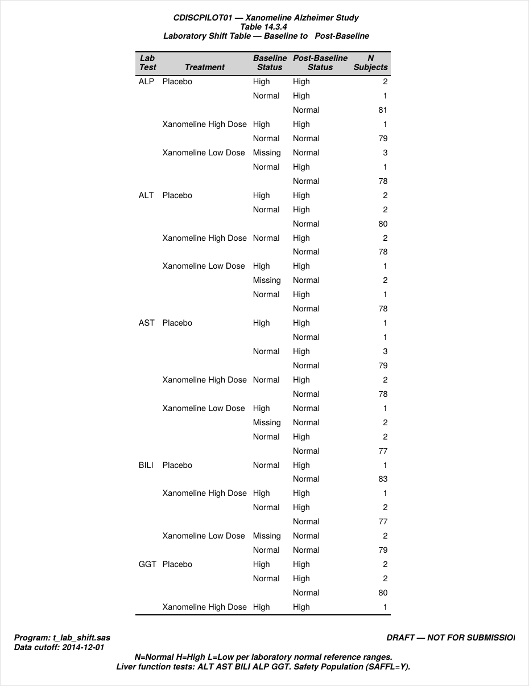
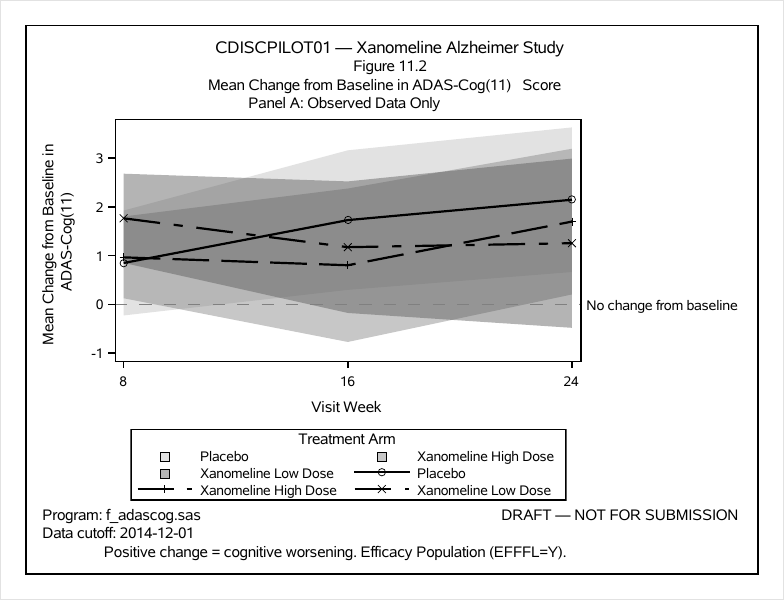
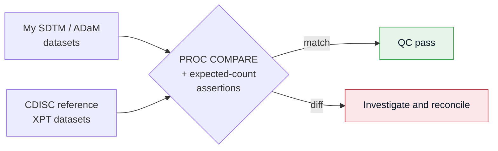
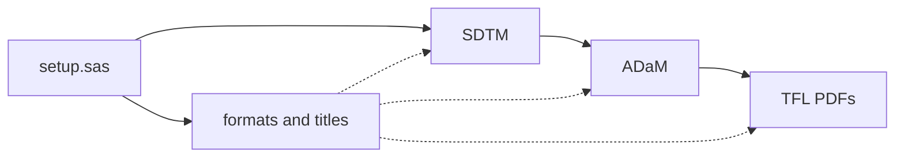

<p align="center">
  
</p>

<h1 align="center">CDISCPILOT01 — Clinical Reporting Pipeline</h1>

<p align="center">
  <em>A SAS pipeline for the CDISC Pilot study: raw XPT data through SDTM and ADaM to the final tables and figures, with a separate QC step that checks my datasets against the CDISC reference data.</em>
</p>

<p align="center">
  
  
  
  
  
  
  
</p>

---

## Table of Contents

- [Overview](#overview)
- [What this project demonstrates](#what-this-project-demonstrates)
- [Pipeline architecture](#pipeline-architecture)
- [Repository structure](#repository-structure)
- [The data flow in detail](#the-data-flow-in-detail)
- [Sample outputs](#sample-outputs)
- [Independent QC / validation](#independent-qc--validation)
- [Standards & compliance](#standards--compliance)
- [How to run](#how-to-run)
- [Author](#author)
- [Disclaimer](#disclaimer)

---

## Overview

This is a full SDTM-through-reporting workflow built on the public CDISC Pilot study (`CDISCPILOT01`), a Phase 3 randomised, placebo-controlled trial of Xanomeline (transdermal) in patients with mild-to-moderate Alzheimer's disease. I take the raw study data all the way through to the final tables and figures, the way it would be done on an actual trial.

<table>
  <thead>
    <tr>
      <th></th>
      <th></th>
    </tr>
  </thead>
  <tbody>
    <tr>
      <td><strong>Study</strong></td>
      <td>CDISCPILOT01 — Xanomeline (Low / High dose) vs Placebo</td>
    </tr>
    <tr>
      <td><strong>Design</strong></td>
      <td>Phase 3, randomised, parallel‑group</td>
    </tr>
    <tr>
      <td><strong>Population</strong></td>
      <td>254 randomised subjects (Placebo 86 · High 84 · Low 84)</td>
    </tr>
    <tr>
      <td><strong>Primary endpoint</strong></td>
      <td>Change from baseline in <strong>ADAS‑Cog (11)</strong> total score (<code>PARAMCD = ACTOT</code>)</td>
    </tr>
    <tr>
      <td><strong>Deliverables</strong></td>
      <td>5 SDTM domains · 4 ADaM datasets · 6 portfolio TFL outputs · independent QC suite</td>
    </tr>
    <tr>
      <td><strong>Tooling</strong></td>
      <td>Base SAS · <code>PROC</code> step + DATA step · ODS PDF · SGPLOT</td>
    </tr>
  </tbody>
</table>

Everything runs off the openly available CDISC Pilot `.xpt` files, which I use as both the source data and the reference for QC. It's a portfolio project, not a regulatory submission.

---

## What this project demonstrates

<table>
  <thead>
    <tr>
      <th>Area</th>
      <th>Demonstrated in this repo</th>
    </tr>
  </thead>
  <tbody>
    <tr>
      <td><strong>CDISC standards</strong></td>
      <td>SDTM domain &amp; <code>SUPP--</code> builds and core ADaM <code>BDS</code>/<code>ADSL</code>-style analysis datasets from the public CDISC Pilot data</td>
    </tr>
    <tr>
      <td><strong>SAS core</strong></td>
      <td>DATA step, <code>PROC SQL</code>, <code>PROC FREQ/MEANS/COMPARE</code>, <code>PROC SORT</code>, macro variables, <code>%include</code> modularisation</td>
    </tr>
    <tr>
      <td><strong>Derivation logic</strong></td>
      <td>Treatment‑emergent flags (<code>TRTEMFL</code>/<code>AETRTEM</code>), population flags (<code>SAFFL</code>, <code>ITTFL</code>, <code>EFFFL</code>), baseline/change logic, and documented LOCF use from reference ADQSADAS</td>
    </tr>
    <tr>
      <td><strong>Regulatory-style reporting</strong></td>
      <td>Demography, disposition, AE &amp; serious‑AE summaries, lab shift tables, and an efficacy figure — <code>ODS PDF</code> via <code>PROC REPORT</code>/<code>FREQ</code> and <code>PROC SGPLOT</code>, numbered to ICH E3</td>
    </tr>
    <tr>
      <td><strong>Quality</strong></td>
      <td>Independent QC layer that cross‑checks every output against the <strong>CDISC reference XPTs</strong> and pre‑specified expected counts, plus embedded inline QC frequencies</td>
    </tr>
    <tr>
      <td><strong>Engineering</strong></td>
      <td>Reproducible single‑driver pipeline (<code>run_all.sas</code> + centralised <code>setup.sas</code>), consistent headers, and full modification history</td>
    </tr>
  </tbody>
</table>

---

## Pipeline architecture

Data moves left to right through four stages. I derive most of the SDTM and ADaM datasets in the project programs; for a couple of the more involved reference ADaM inputs (ADQSADAS and ADLBC) I read the official reference dataset directly instead, which I explain under Known scope decisions.



---

## Repository structure

```text
Clinical_Project/
├── setup.sas                     # Libnames, formats, titles, sourced by every program
├── run_all.sas                   # Master driver, runs everything in dependency order
│
├── sdtm/                         # SDTM domain builds
│   ├── dm.sas                    #    Demographics
│   ├── vs.sas                    #    Vital Signs
│   ├── ae.sas                    #    Adverse Events
│   ├── suppae.sas                #    Supplemental AE  (derives AETRTEM)
│   └── suppdm.sas                #    Supplemental DM
│
├── adam/                         # ADaM analysis datasets
│   ├── adsl.sas                  #    Subject-Level dataset
│   ├── adsl_additions.sas        #    Additional ADSL derivations
│   ├── adsl_comp_update.sas      #    Completion-status update
│   ├── advs.sas                  #    Vital Signs analysis
│   ├── adae.sas                  #    Adverse Events analysis (TRTEMFL, imputation)
│   └── adqsadas.sas              #    Reads official ADQSADAS XPT for ADAS-Cog efficacy structure
│
├── tfl/                          # Tables, listings & figures
│   ├── t_demog.sas               #    Table 14.1.1  Demographics
│   ├── t_disposition.sas         #    Table 14.1.2  Subject disposition
│   ├── t_ae.sas                  #    Table 14.3.1  TEAE by SOC
│   ├── t_ae_serious.sas          #    Table 14.3.2  Serious AEs
│   ├── t_lab_shift.sas           #    Table 14.3.4  Laboratory shift
│   └── f_adascog.sas             #    Figure 11.2   Mean change in ADAS-Cog
│
├── validation/                   # Independent QC / validation
│   ├── check_reference_uploads.sas
│   ├── crosscheck_reference.sas  #    Diff vs CDISC reference XPTs + expected counts
│   └── advs_deep_compare.sas     #    ADVS row-count diagnostic vs reference
│
├── output/                       # Final rendered PDFs (TFLs)
│   ├── t_14_1_1_demog.pdf
│   ├── t_14_1_2_disposition.pdf
│   ├── t_14_3_1_ae.pdf
│   ├── t_14_3_2_ae_serious.pdf
│   ├── t_14_3_4_lab_shift.pdf
│   └── f_11_2_adascog.pdf
│
└── docs/img/                     # README assets
```

---

## The data flow in detail

### SDTM domains

<table>
  <thead>
    <tr>
      <th>Domain</th>
      <th>Program</th>
      <th>Description</th>
      <th>Notable handling</th>
    </tr>
  </thead>
  <tbody>
    <tr>
      <td><strong>DM</strong></td>
      <td><code>sdtm/dm.sas</code></td>
      <td>Demographics, one row per subject</td>
      <td>Treatment‑arm QC, age‑distribution checks</td>
    </tr>
    <tr>
      <td><strong>VS</strong></td>
      <td><code>sdtm/vs.sas</code></td>
      <td>Vital signs (SYSBP, DIABP, PULSE, WEIGHT, …)</td>
      <td>ISO‑8601 dates, <code>VSSTRESN</code> standardisation</td>
    </tr>
    <tr>
      <td><strong>AE</strong></td>
      <td><code>sdtm/ae.sas</code></td>
      <td>Adverse events with MedDRA <code>AEDECOD</code> / <code>AEBODSYS</code></td>
      <td>Severity &amp; seriousness QC frequencies</td>
    </tr>
    <tr>
      <td><strong>SUPPAE</strong></td>
      <td><code>sdtm/suppae.sas</code></td>
      <td>Supplemental qualifier carrying <strong><code>AETRTEM</code></strong></td>
      <td>Vertical <code>QNAM/QVAL</code> structure; row count reconciled to AE</td>
    </tr>
    <tr>
      <td><strong>SUPPDM</strong></td>
      <td><code>sdtm/suppdm.sas</code></td>
      <td>Supplemental DM qualifiers</td>
      <td>Standard <code>SUPP--</code> model</td>
    </tr>
  </tbody>
</table>

### ADaM datasets

<table>
  <thead>
    <tr>
      <th>Dataset</th>
      <th>Program</th>
      <th>Key derivations</th>
    </tr>
  </thead>
  <tbody>
    <tr>
      <td><strong>ADSL</strong></td>
      <td><code>adam/adsl.sas</code> (+ additions/comp update)</td>
      <td><code>TRT01P/TRT01PN</code>, <code>SAFFL</code>, <code>ITTFL</code>, <code>EFFFL</code>, treatment start/end dates; one row per subject, and everything else merges onto it</td>
    </tr>
    <tr>
      <td><strong>ADVS</strong></td>
      <td><code>adam/advs.sas</code></td>
      <td>Direct VS-to-ADVS-style derivation with <code>PARAMCD/PARAM/PARAMN</code>, <code>AVAL</code>, baseline/change, <code>TRTP/TRTPN</code>; documented simplification vs reference visit-window logic</td>
    </tr>
    <tr>
      <td><strong>ADAE</strong></td>
      <td><code>adam/adae.sas</code></td>
      <td><strong><code>TRTEMFL</code></strong> treatment‑emergent flag, treatment variables, and AE analysis-ready structure</td>
    </tr>
    <tr>
      <td><strong>ADQSADAS</strong></td>
      <td><code>adam/adqsadas.sas</code></td>
      <td>Read from official reference ADaM XPT to preserve complex ADAS-Cog item-level, <code>ACTOT</code>, <code>BASE</code>/<code>CHG</code>, <code>DTYPE=LOCF</code>, and <code>ANL01FL</code> structure</td>
    </tr>
  </tbody>
</table>

### Output TFLs (ICH E3 numbering)

<table>
  <thead>
    <tr>
      <th>Output</th>
      <th>Program</th>
      <th>Type</th>
      <th>Population</th>
    </tr>
  </thead>
  <tbody>
    <tr>
      <td><strong>Table 14.1.1</strong> Demographics &amp; baseline characteristics</td>
      <td><code>t_demog.sas</code></td>
      <td>Table</td>
      <td>Safety</td>
    </tr>
    <tr>
      <td><strong>Table 14.1.2</strong> Subject disposition</td>
      <td><code>t_disposition.sas</code></td>
      <td>Table</td>
      <td>All randomised</td>
    </tr>
    <tr>
      <td><strong>Table 14.3.1</strong> Treatment‑emergent AEs by SOC</td>
      <td><code>t_ae.sas</code></td>
      <td>Table</td>
      <td>Safety</td>
    </tr>
    <tr>
      <td><strong>Table 14.3.2</strong> Serious adverse events</td>
      <td><code>t_ae_serious.sas</code></td>
      <td>Table</td>
      <td>Safety</td>
    </tr>
    <tr>
      <td><strong>Table 14.3.4</strong> Laboratory shift table</td>
      <td><code>t_lab_shift.sas</code></td>
      <td>Table</td>
      <td>Safety</td>
    </tr>
    <tr>
      <td><strong>Figure 11.2</strong> Mean change from baseline in ADAS‑Cog(11)</td>
      <td><code>f_adascog.sas</code></td>
      <td>Figure</td>
      <td>Efficacy</td>
    </tr>
  </tbody>
</table>

---

## Sample outputs

These are screenshots of the PDFs in `output/`. Each one has the study header, the ICH-style table number, a program footnote, and a `DRAFT — NOT FOR SUBMISSION` watermark.

<table>
<tr>
<td width="50%" valign="top">
<strong>Table 14.1.1 — Demographics</strong><br>

</td>
<td width="50%" valign="top">
<strong>Table 14.1.2 — Disposition</strong><br>

</td>
</tr>
<tr>
<td width="50%" valign="top">
<strong>Table 14.3.1 — TEAEs by System Organ Class</strong><br>

</td>
<td width="50%" valign="top">
<strong>Table 14.3.2 — Serious Adverse Events</strong><br>

</td>
</tr>
<tr>
<td width="50%" valign="top">
<strong>Table 14.3.4 — Laboratory Shift</strong><br>

</td>
<td width="50%" valign="top">
<strong>Figure 11.2 — Mean Change in ADAS‑Cog(11)</strong><br>

</td>
</tr>
</table>

---

## Independent QC / validation

I didn't just eyeball the outputs. The programs under `validation/` check my datasets against the official CDISC Pilot reference data and a set of counts I wrote down ahead of time.



The QC programs assert concrete, pre‑specified expectations, for example:

- `SUPPAE` row count equals the parent `AE` row count.
- `AETRTEM` comes out to `Y = 1126`, `N = 65`.
- `ADQSADAS` `ACTOT` record count and the LOCF vs observed split (`ABLFL`, `ANL01FL`, `EFFFL`) reconcile.
- Subject counts by treatment arm reconcile across DM, ADSL and the TFLs (254 randomised).

The point is to show the numbers actually reconcile, not just that the code ran without errors.

---

## Standards & compliance

<table>
  <thead>
    <tr>
      <th>Area</th>
      <th>Standard applied</th>
    </tr>
  </thead>
  <tbody>
    <tr>
      <td>Tabulation model</td>
      <td><strong>CDISC SDTM</strong> Implementation Guide</td>
    </tr>
    <tr>
      <td>Analysis model</td>
      <td><strong>CDISC ADaM</strong> Implementation Guide</td>
    </tr>
    <tr>
      <td>AE coding variables</td>
      <td><code>AEDECOD</code> (preferred term) · <code>AEBODSYS</code> (system organ class) used for AE summaries</td>
    </tr>
    <tr>
      <td>Dates</td>
      <td>ISO 8601 date handling from source SDTM-style XPTs</td>
    </tr>
    <tr>
      <td>Output numbering</td>
      <td><strong>ICH E3</strong> (§14 tables, §11 efficacy figures)</td>
    </tr>
    <tr>
      <td>Reproducibility</td>
      <td>Single‑driver build, centralised setup, full program headers + mod history</td>
    </tr>
  </tbody>
</table>

---

## Known scope decisions

A few deliberate shortcuts, since this is a portfolio and not a real submission:

- `ADQSADAS` is read from the official reference ADaM XPT to keep the complex ADAS-Cog item-level, ACTOT, LOCF and analysis-flag structure intact.
- `ADLBC` is used for the liver lab shift table instead of deriving a full LB-to-ADLBC pipeline.
- `ADVS` is a direct VS-to-ADVS derivation; it doesn't reproduce the reference dataset's extra End of Treatment and visit-window records.
- QC is targeted independent checking, not full line-by-line double programming.
- The six PDFs are portfolio-style outputs in a regulatory format, not final CSR shells.

---

## How to run

You'll need Base SAS (or SAS OnDemand / SAS Studio) and the CDISC Pilot raw `.xpt` files in `rawdata/`.

1. **Configure paths.** Edit the project root in [`setup.sas`](setup.sas):
   ```sas
   %let root = /path/to/Clinical Project;
   ```
2. **Run the whole study** with the master driver:
   ```sas
   %include "/path/to/Clinical Project/run_all.sas";
   ```
   This runs SDTM, then ADaM, then the TFLs, with progress `%put` notes along the way.
3. **(Optional) run QC** against the reference data:
   ```sas
   %include ".../validation/crosscheck_reference.sas";
   ```
4. **Collect the output.** The rendered PDFs land in [`output/`](output/).



---

## Author

**Chetan Dhingra**, Statistical / Clinical SAS Programmer

<p>
  <a href="#"></a>
  <a href="#"></a>
  <a href="#"></a>
</p>

---

## Disclaimer

Built on the publicly available CDISC Pilot Project data, for educational and portfolio use only. All outputs are marked `DRAFT — NOT FOR SUBMISSION` and aren't an actual regulatory deliverable. Xanomeline and CDISCPILOT01 are used here just because they're the well-known open reference study for CDISC work.
